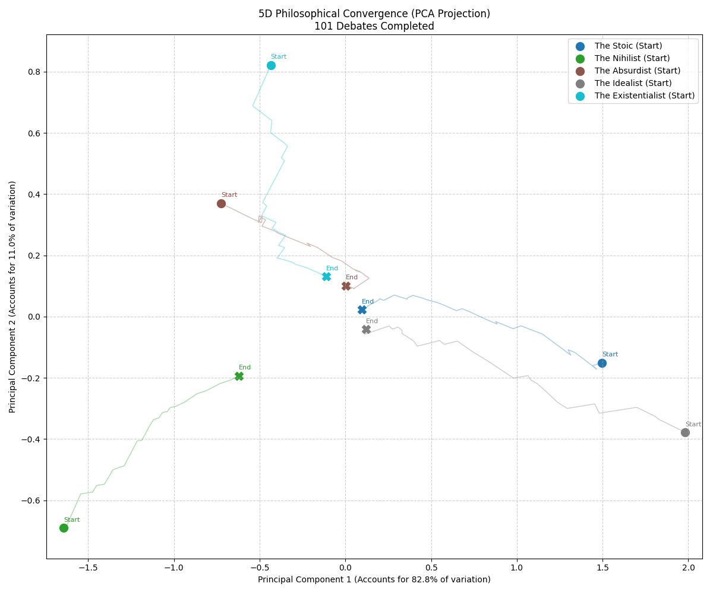

# The Existential Agora: Multi-Agent Philosophical Convergence

An asynchronous multi-agent simulation that models ideological drift and philosophical convergence within a 5D vector space. Using the Gemini-3-Flash API, autonomous agents engage in debates on the nature of meaning, updating their core beliefs based on the mathematical principles of linear interpolation and resistance-based entrenchment.

## Project Overview

The simulation initializes five NPCs with distinct philosophical profiles (Stoic, Nihilist, Absurdist, Idealist, and Existentialist). Each profile is mapped to a 5D vector within a unit hypercube. Through asynchronous discourse, the system tracks how these agents influence one another, ultimately visualizing the "Social Entropy" of the group using Principal Component Analysis (PCA).

### Key Features
- **Asynchronous Orchestration:** High-concurrency environment built with `asyncio`, utilizing mutex locks to ensure thread-safe file I/O and plotting.
- **High-Dimensional Modeling:** Maps abstract reasoning to a 5D space representing Optimism, Agency, Objectivity, Sociality, and Temporality.
- **PCA Visualization:** Reduces 5D data to a 2D projection, capturing ~93% of global variance to demonstrate true ideological convergence.
- **Mathematical Update Formula:** Implements custom belief-shift logic with a non-linear resistance factor based on Euclidean distance.

---

## Mathematical Intuition

The core of the simulation is the **Vector Update Formula**. After each debate, an NPC’s belief vector $V$ is updated toward the opponent's vector $V_{target}$ using weighted linear interpolation:

$$V_{new} = V_{current} + (\eta \cdot P \cdot R) \cdot (V_{target} - V_{current})$$

### Variables:
* **$V$**: The 5D Philosophical Vector.
* **$\eta$**: The **Learning Rate**, defining the base step size of any shift.
* **$P$**: The **Persuasion Score** ($0.0$ to $1.0$), determined by the LLM's evaluation of the opponent's logic.
* **$R$**: The **Resistance Factor**. This introduces non-linear damping; if the Euclidean distance between two agents exceeds a threshold, the influence is halved to simulate ideological entrenchment.


---

## Installation & Setup

### Prerequisites
* Python 3.9+
* Google Gemini API Key (Obtain from [Google AI Studio](https://aistudio.google.com/))

### Getting Started
1. **Clone the repository:**
   ```bash
   git clone [https://github.com/Jackson-Brooks/agora.git](https://github.com/Jackson-Brooks/agora.git)
   cd agora
   ```
2. **Install dependencies:**
   ```bash
   pip install -r requirements.txt
   ```
3. Create a .env file:
   ```bash
   GOOGLE_API_KEY=your_key
   ```
4. Run Simulation:
   ```bash
   python existential_agora.py
   ```

## Results & Analysis

### Global Convergence
- **Variance Collapse:** After 100 generations (debates), the simulation consistently demonstrates a **90%+ reduction in global variance**. This indicates that the asynchronous discourse successfully moderates extreme viewpoints, moving the population toward a "Global Mean" philosophy.
- **PCA Trajectories:** The generated `agora_visualization_pca.png` captures over 93% of the ideological drift. Movement toward the cluster center represents mathematical consensus-building across all five dimensions.

### The "Nihilist Anchor" Observation
Across multiple runs, **The Nihilist** consistently proved to be the most "stubborn" agent, exhibiting the lowest total Euclidean movement. This phenomenon is driven by two factors:

1. **Mathematical Entrenchment:** Because the Nihilist begins at an extreme vertex of the 5D hypercube, the distance to other agents often exceeds the `RESISTANCE_THRESHOLD`. This triggers a 50% reduction in their learning rate, simulating the difficulty of persuading someone with deeply entrenched, skeptical views.
2. **Real-World Parallel:** This mirrors the psychological "Asymmetry of Persuasion." While optimistic or teleological frameworks require constant validation of meaning, a nihilistic framework is defensive; it treats chaos not as a challenge to be overcome, but as a confirmation of its baseline premise. In the Agora, as in life, it is mathematically and rhetorically easier to deconstruct meaning than to construct it.



## Development Methodology
- This project was developed using an iterative AI-human pair programming approach. While Generative AI assisted in streamlining boilerplate code and refining asynchronous patterns, the core mathematical architecture—including the vector update logic, Euclidean distance constraints, and PCA integration—was manually designed and verified to ensure rigorous data analysis.


